<!-- _class: invert -->
# <!-- fit --> Predição de vendas das Lojas ROSSMANN

---

# Sumário

1. Contexto
2. Desafio (problema)
3. Desenvolvimento da solução
5. Conclusão e demonstração
6. Próximos passos

---

# 1. Contexto

- Reunião mensal de resultados
- CFO pediu previsão de vendas das próximos 6 semanas de cada loja

---

# 2. Desafio

## Problema
- Definição do budget para a reforma das lojas

## Causas
- Predição de vendas atual apresentava muita divergência
- Processo de predição de vendas é baseado em experiências passadas
- As previsões de vendas das 1115 lojas é feita manualmente
- A visualização das vendas é acessada apenas via computador

---

## Solução
- Usar Machine Learning para realizar a previsão de vendas de todas as lojas
- Visualização das predições de vendas poderão ser acessadas pelo smartpho

---

# 3. Desenvolvimento da solução

---

## Descrição dos dados

```python
print(f'Number of rows: {df1.shape[0]}')
print(f'Number of columns: {df1.shape[1]}')
```

---

## Estatística descritiva

<style scoped>
table {
    height: 100%;
    width: 100%;
    font-size: 12px;
}
</style>

|                              |       count |        mean |          std |   min |   25% |   50% |   75% |    max |   median |   range |        skew |   kurtosis |
|:-----------------------------|------------:|------------:|-------------:|------:|------:|------:|------:|-------:|---------:|--------:|------------:|-----------:|
| store                        | 1.01721e+06 |  558.43     |   321.909    |     1 |   280 |   558 |   838 |   1115 |      558 |    1114 | -0.00095488 |  -1.20052  |
| day_of_week                  | 1.01721e+06 |    3.99834  |     1.99739  |     1 |     2 |     4 |     6 |      7 |        4 |       6 |  0.00159282 |  -1.24687  |
| sales                        | 1.01721e+06 | 5773.82     |  3849.93     |     0 |  3727 |  5744 |  7856 |  41551 |     5744 |   41551 |  0.64146    |   1.77837  |
| customers                    | 1.01721e+06 |  633.146    |   464.412    |     0 |   405 |   609 |   837 |   7388 |      609 |    7388 |  1.59865    |   7.09177  |
| open                         | 1.01721e+06 |    0.830107 |     0.375539 |     0 |     1 |     1 |     1 |      1 |        1 |       1 | -1.75804    |   1.09072  |
| promo                        | 1.01721e+06 |    0.381515 |     0.485759 |     0 |     0 |     0 |     1 |      1 |        0 |       1 |  0.487838   |  -1.76202  |
| school_holiday               | 1.01721e+06 |    0.178647 |     0.383056 |     0 |     0 |     0 |     0 |      1 |        0 |       1 |  1.67784    |   0.815154 |
| competition_distance         | 1.01721e+06 | 5935.44     | 12547.7      |    20 |   710 |  2330 |  6910 | 200000 |     2330 |  199980 | 10.2423     | 147.79     |
| competition_open_since_month | 1.01721e+06 |    6.78685  |     3.31109  |     1 |     4 |     7 |    10 |     12 |        7 |      11 | -0.0420756  |  -1.23261  |
| competition_open_since_year  | 1.01721e+06 | 2010.32     |     5.51559  |  1900 |  2008 |  2012 |  2014 |   2015 |     2012 |     115 | -7.23566    | 124.071    |
| promo2                       | 1.01721e+06 |    0.500564 |     0.5      |     0 |     0 |     1 |     1 |      1 |        1 |       1 | -0.0022552  |  -2        |
| promo2_since_week            | 1.01721e+06 |   23.619    |    14.3101   |     1 |    12 |    22 |    37 |     52 |       22 |      51 |  0.178723   |  -1.18405  |
| promo2_since_year            | 1.01721e+06 | 2012.79     |     1.66266  |  2009 |  2012 |  2013 |  2014 |   2015 |     2013 |       6 | -0.784436   |  -0.210075 |
| is_promo                     | 1.01721e+06 |    0.165966 |     0.37205  |     0 |     0 |     0 |     0 |      1 |        0 |       1 |  1.79564    |   1.22434  |

---

## Mapa mental de hipóteses

<style>
img[alt~="center"] {
  display: block;
  margin: 0 auto;
}
</style>


---

## Hipóteses da análise exploratória

1. Lojas com maior sortimentos deveriam vender mais.
2. Lojas com competidores mais próximos deveriam vender menos.
3. Lojas com competidores à mais tempo deveriam vendem mais.
4. Lojas com promoções ativas por mais tempo deveriam vender mais.
5. Lojas com mais dias de promoção deveriam vender mais.
6. Lojas com mais promoções consecutivas deveriam vender mais.
7. Lojas abertas durante o feriado de Natal deveriam vender mais.
8. Lojas deveriam vender mais ao longo dos anos.
9. Lojas deveriam vender mais no segundo semestre do ano.
10. Lojas deveriam vender mais depois do dia 10 de cada mês.
11. Lojas deveriam vender menos aos finais de semana.
12. Lojas deveriam vender menos durante os feriados escolares.

---

## Análise exploratória de dados

### Response variable


---

### Numerical variable

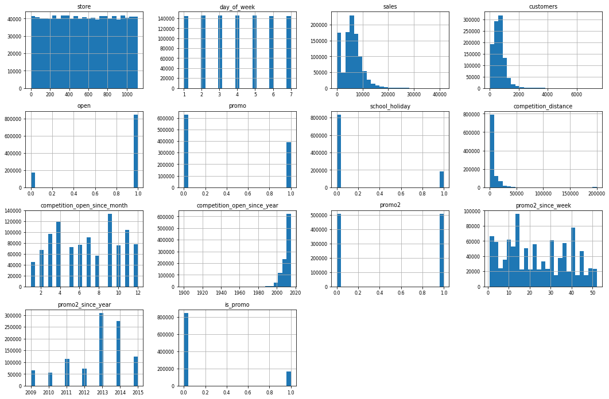

---

### Categorical variable

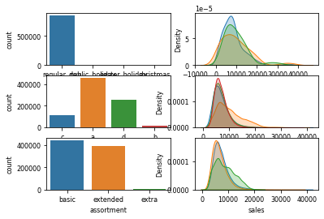

---

## Validação das hipóteses

### **H1.** Lojas com maior sortimentos deveriam vender mais.
**FALSO** Lojas com maior sortimento vendem MENOS

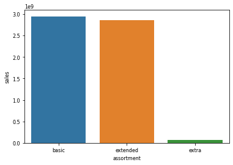 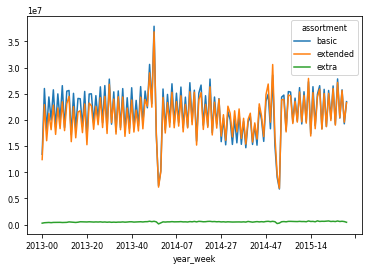 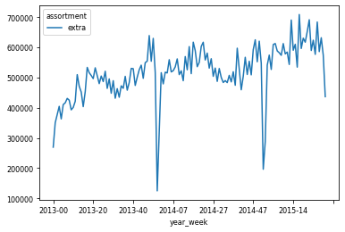

---

### **H7.** Lojas abertas durante o feriado de Natal deveriam vender mais.
**FALSO** Lojas abertas no Natal vendem MENOS

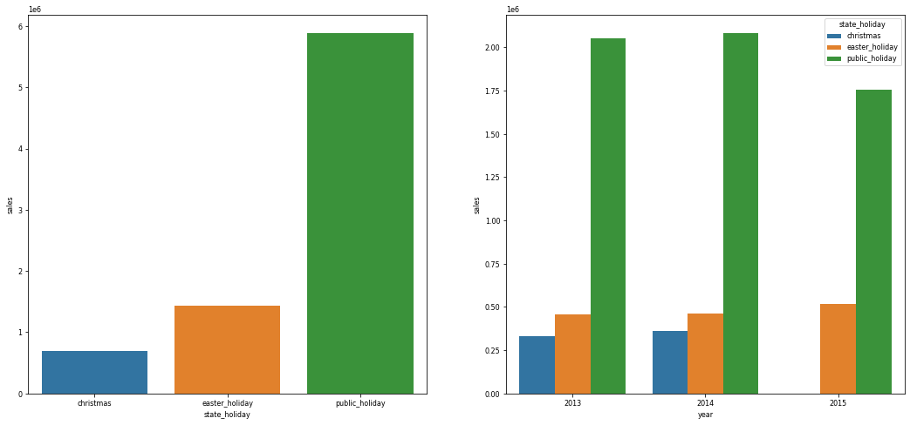

---

### **H10.** Lojas deveriam vender mais depois do dia 10 de cada mês.
**VERDADE** Lojas vendem mais após o dia 10 de cada mês

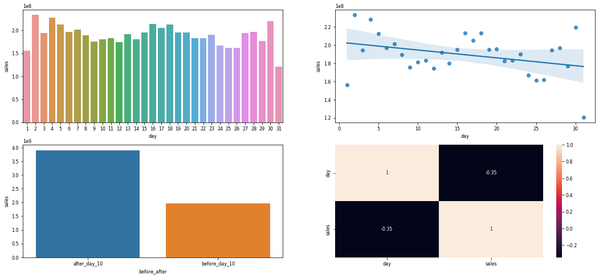

---

## Numerical Attributes

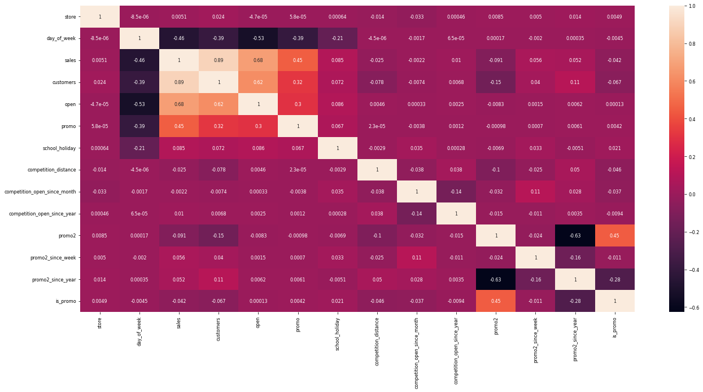

---

## Categorical Attributes

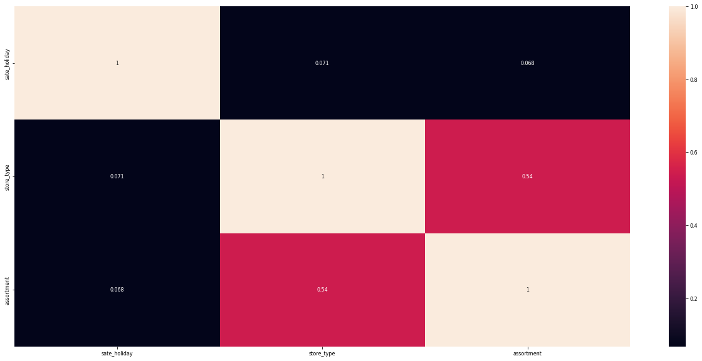

---

## Machine Learning

### Model performance comparison

<br/>

<style scoped>
table {
    margin-left: auto;
    margin-right: auto;
    font-size: 25px;
}
</style>
|         Model Name |             MAE CV |       MAPE CV |            RMSE CV |
|-------------------:|-------------------:|--------------:|-------------------:|
|      Random Forest |  842.89 +/- 166.49 | 0.12 +/- 0.02 |  1265.85 +/- 256.1 |
| XGBoost Regression | 1270.03 +/- 170.58 | 0.18 +/- 0.02 | 1814.91 +/- 208.25 |
|  Linear Regression | 2077.68 +/- 255.49 | 0.31 +/- 0.01 | 2932.47 +/- 400.64 |
|              Lasso | 2111.17 +/- 299.92 |  0.3 +/- 0.01 | 3042.07 +/- 444.46 |

---

# 4. Conclusão e demonstração

## Tradução e interpretação do erro

---

## Buisiness performance

<style scoped>
table {
    margin-left: auto;
    margin-right: auto;
    font-size: 15px;
}
</style>

| store |  predictions | worst_scenario | best_scenario |         MAE |     MAPE |
|------:|-------------:|---------------:|--------------:|------------:|---------:|
|     1 | 2.811592e+05 |   2.808655e+05 |  2.814529e+05 |  293.721014 | 0.065709 |
|     2 | 3.177814e+05 |   3.173682e+05 |  3.181947e+05 |  413.243924 | 0.084676 |
|     3 | 4.495737e+05 |   4.489861e+05 |  4.501612e+05 |  587.538795 | 0.081867 |
|     4 | 5.979354e+05 |   5.971867e+05 |  5.986841e+05 |  748.708589 | 0.074511 |
|     5 | 3.134978e+05 |   3.130230e+05 |  3.139726e+05 |  474.796817 | 0.120908 |
|   ... |          ... |            ... |           ... |         ... |      ... |
|  1111 | 3.074939e+05 |   3.068599e+05 |  3.081279e+05 |  633.986675 | 0.146836 |
|  1112 | 5.479548e+05 |   5.470155e+05 |  5.488941e+05 |  939.311098 | 0.102124 |
|  1113 | 4.226130e+05 |   4.221317e+05 |  4.230942e+05 |  481.266137 | 0.076457 |
|  1114 | 1.272342e+06 |   1.269555e+06 |  1.275130e+06 | 2787.698025 | 0.119583 |
|  1115 | 4.155457e+05 |   4.147952e+05 |  4.162961e+05 |  750.442021 | 0.097351 |

---

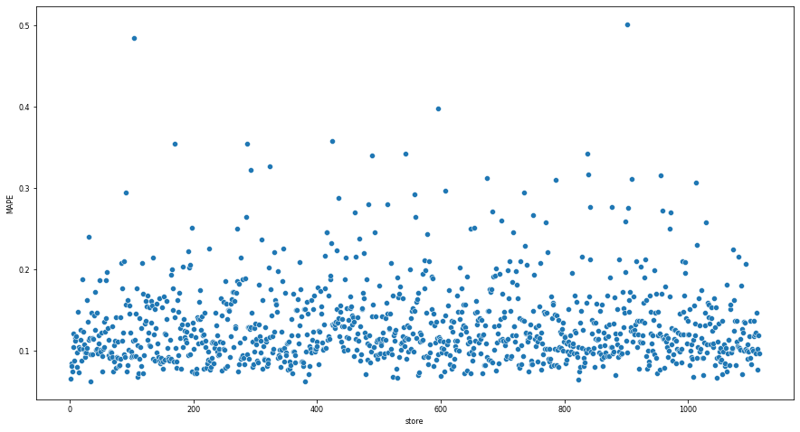

---

## Total performance

<style scoped>
table {
    margin-left: auto;
    margin-right: auto;
    font-size: 30px;
}
</style>


|      Scenarios |           Values |
|---------------:|-----------------:|
|    predictions | R$480,442,496.00 |
| worst_scenario | R$479,427,001.13 |
|  best_scenario | R$481,457,996.62 |

---

## Machine Learning performance

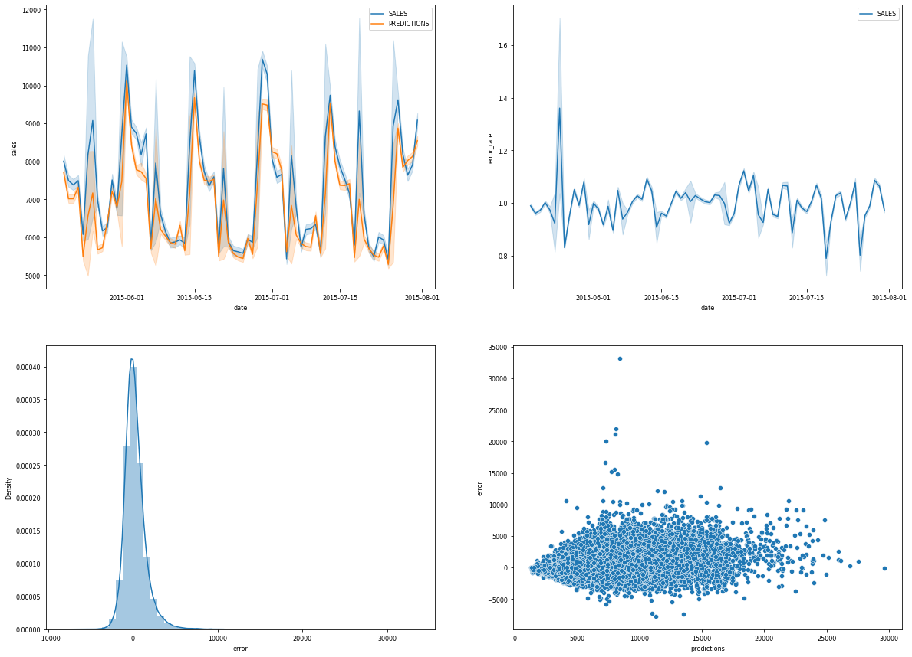

---

## Demonstração do uso

https://youtube.com/shorts/2abtTxgfy5I

---

# 5. Próximos passos

- Workshop do modelo para os Buisiness Users
- Coletar feedback sobra a usabilidade
- Aumentar em 10% a acurácia do modelo

---

# Obrigado